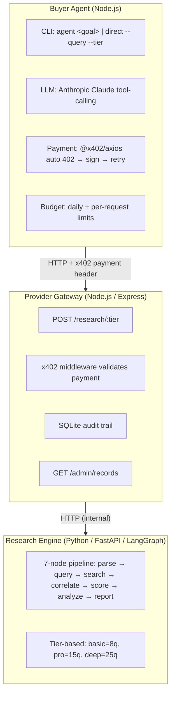
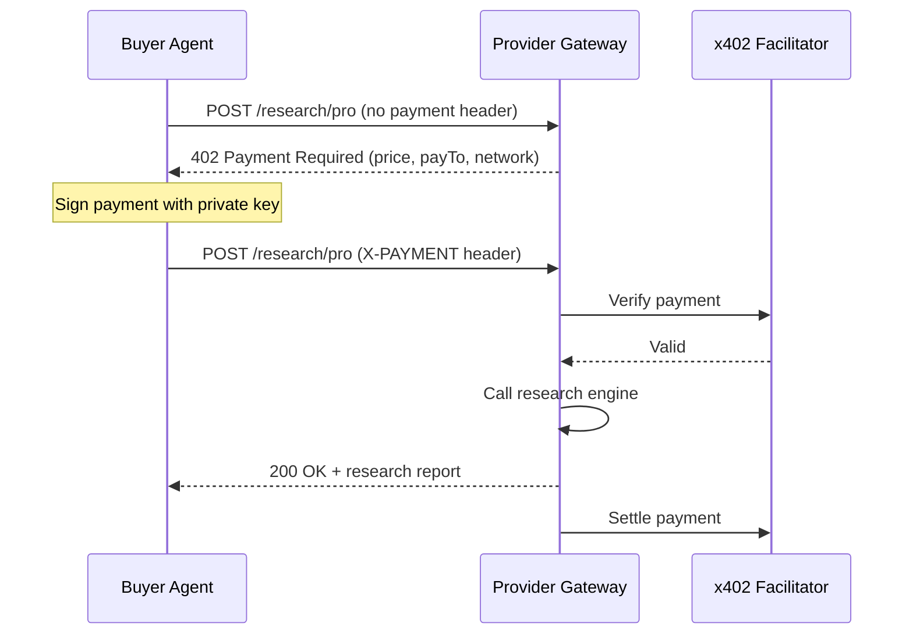
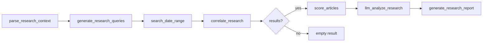

# x402 Agentic Research

An AI buyer agent that purchases premium Web3 market research from a paid HTTP provider using the [x402 payment protocol](https://www.x402.org/).

The system demonstrates the full x402 flow: a request hits a paywall, the agent automatically signs a payment, and the retried request succeeds — all programmatically, with no human intervention.

## Architecture



## x402 Payment Flow



## LangGraph Research Pipeline



## Research Tiers

| Tier | Price | Queries | Report | Causal Chain |
|------|-------|---------|--------|-------------|
| basic | $0.01 USDC | 8 | No | No |
| pro | $0.03 USDC | 15 | Yes | Yes |
| deep | $0.05 USDC | 25 | Yes | Yes |

## Quick Start

### Prerequisites

- Node.js >= 20
- Python >= 3.11
- [pnpm](https://pnpm.io/) (`npm i -g pnpm`)
- [uv](https://docs.astral.sh/uv/) (Python package manager)

### Install

```bash
make install
```

### Run Mock Demo (no API keys needed)

```bash
make demo-mock
```

This starts the engine + gateway in mock mode and runs a buyer agent direct purchase. See [Demo Guide](#demo-guide) for details.

### Run with LLM Agent (requires Anthropic key)

```bash
export AGENT_LLM_API_KEY=sk-ant-...
make demo-agent-mock
```

### Run Full Live Mode

Requires all API keys and a funded Base Sepolia wallet:

```bash
cp .env.example .env
# Fill in: PROVIDER_EVM_ADDRESS, BUYER_EVM_PRIVATE_KEY, TAVILY_API_KEY, etc.
make dev
# In another terminal:
pnpm --filter buyer-agent buyer direct \
  --query "Compare yield-bearing stablecoins on Cardano vs Ethereum" \
  --start-date 2025-10-01 --end-date 2026-03-01 --tier pro
```

### CLI Commands

```bash
# Direct purchase (bypass LLM agent)
pnpm --filter buyer-agent buyer direct \
  --query "..." --start-date YYYY-MM-DD --end-date YYYY-MM-DD [--tier basic|pro|deep]

# LLM agent mode
pnpm --filter buyer-agent buyer agent "Investigate why Ethena USDe TVL dropped in Q4 2025"

# Inspect audit trail
curl http://localhost:8200/admin/records | jq
```

## Demo Guide

### `make demo-mock` — Full Mock Demo

**Requirements:** None (no API keys, no wallet, no network access needed).

**What it does:**
1. Starts the **research engine** on port 8100 in mock mode (returns deterministic canned responses)
2. Starts the **provider gateway** on port 8200 in mock mode (x402 payment middleware disabled)
3. Runs a **buyer agent direct purchase** against the gateway:
   - Query: *"Compare yield-bearing stablecoins on Cardano vs Ethereum L2s"*
   - Date range: 2025-10-01 to 2026-03-01
   - Tier: pro ($0.03)
4. Displays the research result (mock summary + findings)
5. Shuts down all services

**What you'll see:** The full request lifecycle — buyer sends request, gateway routes to engine, engine returns mock result, buyer displays it. No real payments or LLM calls happen.

### `make demo-agent-mock` — LLM Agent Demo

**Requirements:** `AGENT_LLM_API_KEY` environment variable (Anthropic API key).

**What it does:**
1. Starts engine + gateway in mock mode (same as above)
2. Runs the **LLM-powered buyer agent** with a research goal
3. The agent uses Anthropic Claude tool-calling to:
   - Call `list_tiers` to see available options
   - Call `check_budget` to verify the purchase is within limits
   - Call `purchase_research` with an appropriate tier and query
4. Displays the agent's reasoning and final result
5. Shuts down all services

**What you'll see:** The agent autonomously deciding which tier to use, checking budget, and purchasing research. Real LLM calls happen, but the gateway/engine are mocked.

You can pass a custom goal: `./scripts/demo-agent-mock.sh "Your research question here"`

### `make demo` — Full Live Demo

**Requirements:** All env vars configured in `.env` (EVM keys, Tavily, LLM key).

**What it does:** Starts engine + gateway in **live mode** with real x402 payment validation. You run the buyer agent manually in a separate terminal. Real payments happen on Base Sepolia testnet.

## Development

```bash
make install    # Install all dependencies
make build      # Build TypeScript
make test       # Run all tests (41 total)
make lint       # Lint TypeScript + Python
make dev        # Start all services in development mode
```

For detailed testing instructions, see [docs/testing-guide.md](docs/testing-guide.md).

## Tech Stack

- **Buyer Agent**: TypeScript, Commander.js, Anthropic SDK (tool-calling), @x402/axios, viem
- **Provider Gateway**: TypeScript, Express, @x402/express, better-sqlite3, Pino
- **Research Engine**: Python, FastAPI, LangGraph, Tavily
- **Network**: Base Sepolia (USDC testnet)
- **Payment Protocol**: [x402](https://www.x402.org/) v2.6.0

## Project Structure

```
├── apps/
│   ├── buyer-agent/          # AI buyer agent + CLI
│   │   └── src/
│   │       ├── agent/        # LLM agent, tools, prompts
│   │       ├── client/       # x402 client, budget tracker
│   │       └── index.ts      # CLI entry point
│   └── provider-gateway/     # Paid API gateway
│       └── src/
│           ├── middleware/    # x402 payment, request-id, errors
│           ├── routes/       # research + admin endpoints
│           └── services/     # engine client, audit store
├── services/
│   └── research-engine/      # Python LangGraph pipeline
│       └── src/engine/       # 7 graph nodes
├── scripts/                  # Demo scripts
└── docs/                     # Architecture, ADRs, testing guide
```
