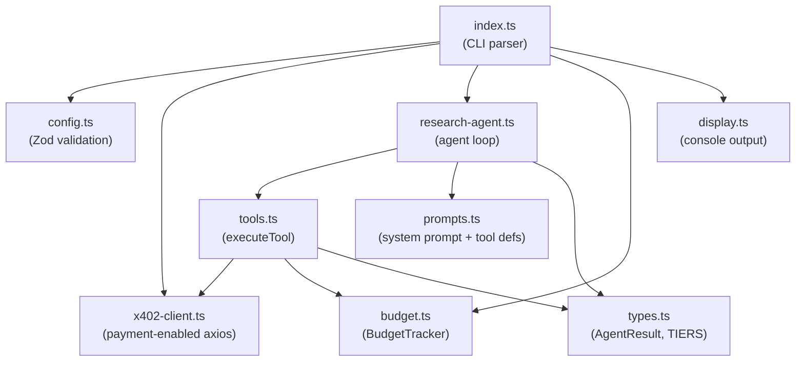
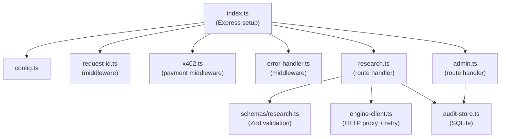
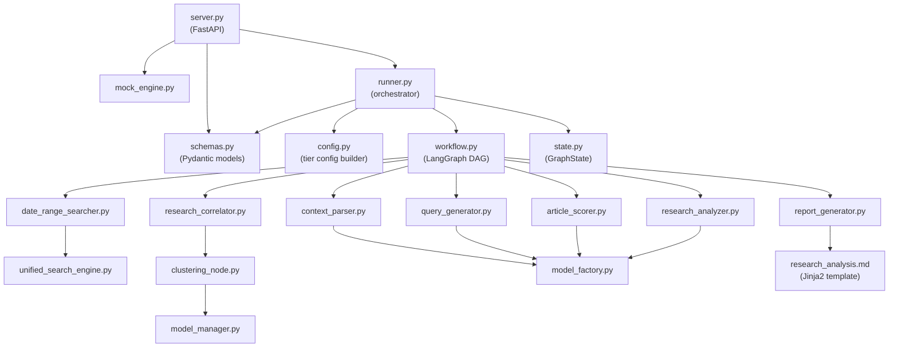
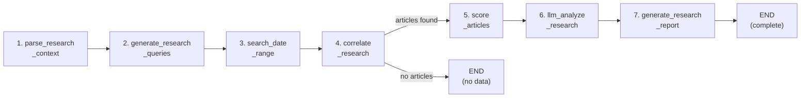
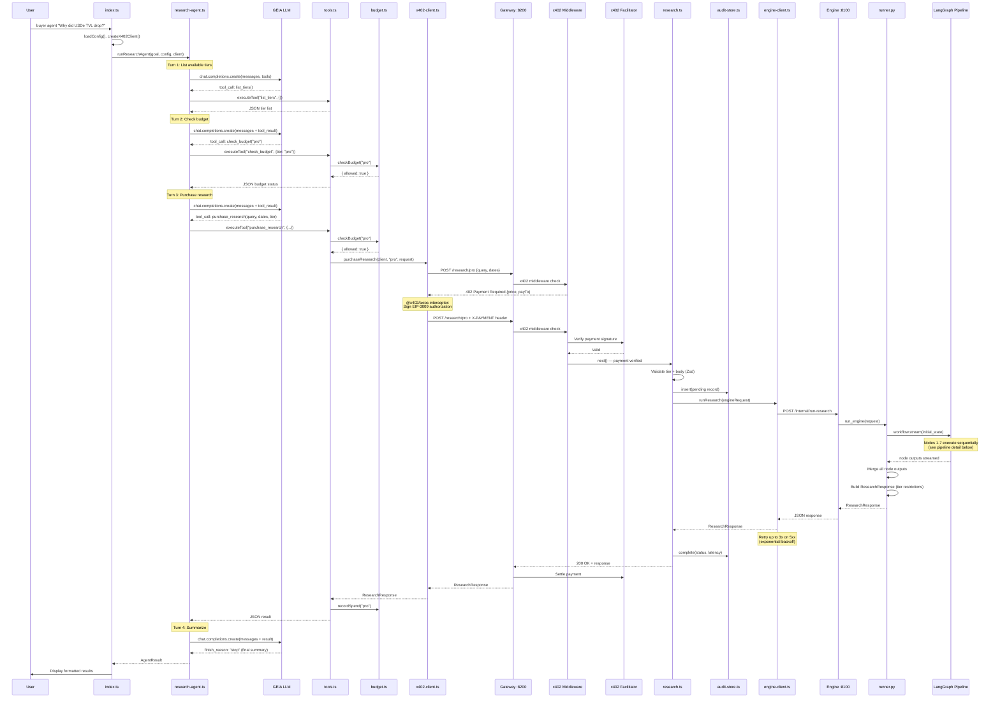
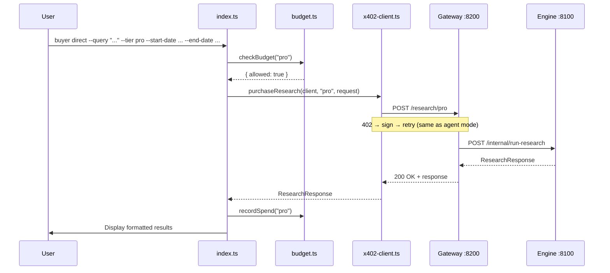
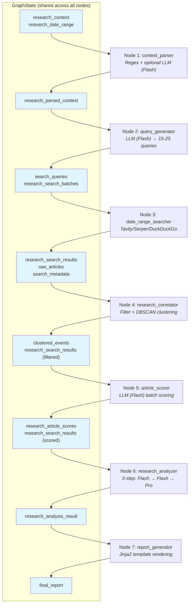
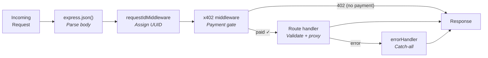

# Implementation Details

This document provides a detailed, implementation-level overview of the system: the key files, internal module communication, and cross-component interactions for the three main services.

> For a high-level architecture overview, see [system-overview.md](system-overview.md).

---

## Table of Contents

- [End-to-End Request Flow](#end-to-end-request-flow)
- [Buyer Agent (`apps/buyer-agent`)](#buyer-agent-appsbuyer-agent)
- [Provider Gateway (`apps/provider-gateway`)](#provider-gateway-appsprovider-gateway)
- [Research Engine (`services/research-engine`)](#research-engine-servicesresearch-engine)
- [Cross-Component Interaction Diagrams](#cross-component-interaction-diagrams)

---

## End-to-End Request Flow

A research purchase traverses the system through this path:

```
CLI input
  → index.ts (parse command)
    → x402-client.ts (create payment-enabled HTTP client)
      → research-agent.ts (LLM agent loop) OR direct purchase
        → POST /research/:tier (gateway)
          → request-id middleware (assign UUID)
            → x402 payment middleware (402 → sign → verify)
              → research.ts route handler (validate, audit insert)
                → engine-client.ts (HTTP proxy with retry)
                  → server.py /internal/run-research
                    → runner.py (init state, run workflow)
                      → 7-node LangGraph pipeline
                    → runner.py (merge state, build response)
                  ← ResearchResponse JSON
                → research.ts (audit update, return response)
              ← 200 OK + research result
            ← response to buyer
          ← display result
```

---

## Buyer Agent (`apps/buyer-agent`)

### File Map

```
src/
├── index.ts                    # CLI entry point (Commander.js)
├── config.ts                   # Zod-validated environment config
├── display.ts                  # Console output formatting
├── client/
│   ├── x402-client.ts          # Payment-enabled axios client + purchaseResearch()
│   └── budget.ts               # In-memory daily + per-request budget tracker
└── agent/
    ├── research-agent.ts       # LLM agent loop (max 10 tool-calling turns)
    ├── tools.ts                # Tool implementations (list_tiers, check_budget, purchase_research)
    ├── types.ts                # AgentResult, TIERS definitions
    └── prompts.ts              # System prompt + tool schemas (Anthropic & OpenAI formats)
```

### Entry Points

**`index.ts`** defines two CLI commands via Commander.js:

| Command | Description | Flow |
|---------|-------------|------|
| `buyer agent "<goal>"` | LLM-driven mode — the agent decides tier, query, and dates | → `runResearchAgent()` |
| `buyer direct --query --tier --start-date --end-date` | Explicit parameters — skips agent reasoning | → `purchaseResearch()` directly |

### Internal Module Communication



### Key Component Details

#### x402 Payment Client (`x402-client.ts`)

Creates an axios instance that automatically handles HTTP 402 payment challenges:

1. Loads buyer's private key → `viem.privateKeyToAccount()`
2. Creates Base Sepolia RPC client → `viem.createPublicClient()`
3. Wraps with EVM signer → `@x402/evm.toClientEvmSigner()`
4. Registers EIP-3009 signing scheme → `@x402/core.registerExactEvmScheme()`
5. Wraps axios with payment interceptor → `@x402/axios.wrapAxiosWithPayment()`

The interceptor is transparent: when the gateway returns 402, the client extracts payment requirements, signs an EIP-3009 authorization, attaches it as a header, and retries — all without caller awareness.

**`purchaseResearch(client, tier, request)`** sends:
```
POST /research/{tier}
Body: { query, start_date, end_date }
→ Returns: ResearchResponse
```

#### Budget Tracker (`budget.ts`)

In-memory enforcement (resets on restart):

- **`checkBudget(tier)`** — validates tier exists, price ≤ per-request limit, daily total within daily limit
- **`recordSpend(tier)`** — increments daily spend counter
- **`getStatus()`** — returns `{ dailySpent, dailyLimit, remaining }`

Hardcoded pricing: basic=$0.01, pro=$0.03, deep=$0.05.

#### Agent Loop (`research-agent.ts`)

`runResearchAgent(goal, config, client)` orchestrates up to 10 LLM tool-calling turns:

```
Initialize OpenAI client (GEIA endpoint)
Set messages = [system_prompt, user_goal]

FOR turn 0..9:
  response = openai.chat.completions.create({
    model, messages, tools: TOOL_DEFINITIONS_OPENAI, max_tokens: 4096
  })

  IF finish_reason == "stop":
    → Agent finished reasoning, break

  IF finish_reason == "tool_calls":
    FOR each tool_call:
      result = executeTool(name, args, { client, budget })
      Append tool result to messages
    CONTINUE to next turn

RETURN AgentResult { goal, tier, query, dates, summary, keyFindings, cost, success }
```

#### Tools (`tools.ts`)

Three tools available to the agent, all return JSON strings:

| Tool | Arguments | What it does |
|------|-----------|--------------|
| `list_tiers` | none | Returns static tier info (name, price, features) from `types.ts` |
| `check_budget` | `tier` | Calls `BudgetTracker.checkBudget()`, returns allowance + budget status |
| `purchase_research` | `query, start_date, end_date, tier` | Pre-checks budget → calls `purchaseResearch()` → records spend → returns result |

### External Calls

| Destination | Protocol | Purpose |
|-------------|----------|---------|
| GEIA (`api.saia.ai/v1`) | OpenAI-compatible REST | LLM tool-calling (agent reasoning) |
| Provider Gateway (`:8200`) | HTTP POST | Research purchase via `/research/{tier}` |
| Base Sepolia RPC | JSON-RPC | EIP-3009 payment signing (via viem) |

---

## Provider Gateway (`apps/provider-gateway`)

### File Map

```
src/
├── index.ts                        # Express server setup, middleware registration
├── config.ts                       # Zod-validated environment config
├── middleware/
│   ├── request-id.ts               # Assigns X-Request-ID if missing (UUID)
│   ├── x402.ts                     # x402 payment middleware configuration
│   └── error-handler.ts            # Global Express error handler
├── routes/
│   ├── research.ts                 # POST /research/:tier handler
│   └── admin.ts                    # GET /admin/records handler
├── services/
│   ├── engine-client.ts            # HTTP client to research engine + retry logic
│   └── audit-store.ts              # SQLite audit trail (better-sqlite3)
└── schemas/
    └── research.ts                 # Zod schemas for request validation + tier config
```

### Middleware Chain

`index.ts` registers middleware in this exact order:

```
1. express.json()                   — Parse JSON body
2. requestIdMiddleware              — Add X-Request-ID header
3. setupPaymentMiddleware()         — x402 payment validation (skipped in mock mode)
4. /research routes                 — Research purchase endpoints
5. /admin routes                    — Audit inspection endpoints
6. errorHandler                     — Catch-all error handler
```

Additionally, a `GET /health` endpoint probes the research engine's `/health`.

### Internal Module Communication



### Key Component Details

#### Payment Middleware (`x402.ts`)

Uses `@x402/express.paymentMiddlewareFromConfig()` to protect three routes:

```
POST /research/basic  → $0.01 USDC
POST /research/pro    → $0.03 USDC
POST /research/deep   → $0.05 USDC
```

**Payment verification flow:**
1. Client request arrives without payment → middleware responds **402 Payment Required** with `{ price, payTo, network, asset }`
2. Client signs EIP-3009 authorization and retries with `X-PAYMENT` header
3. Middleware sends payment to `HTTPFacilitatorClient` at `x402.org/facilitator` for verification
4. If valid → `next()` proceeds to route handler
5. After response → facilitator settles the payment on-chain

**Mock mode:** `setupPaymentMiddleware()` returns immediately without registering any middleware — all requests pass through unpaid.

#### Research Route (`routes/research.ts`)

Handles `POST /research/:tier`:

```
1. Validate tier param with tierSchema (basic|pro|deep)
2. Validate body with researchRequestSchema:
   - query: 10-500 chars
   - start_date, end_date: YYYY-MM-DD, max 365-day range
   - format: "json" | "markdown" | "both" (default: "both")
3. auditStore.insert() — record with status "pending"
4. engineClient.runResearch() — proxy to engine (with retry)
5. auditStore.complete() — update status + latency
6. Return engine response or 502 on failure
```

#### Engine Client (`services/engine-client.ts`)

Proxies requests to the research engine at `POST /internal/run-research`:

```typescript
// Request payload
{
  request_id: string,
  query: string,
  start_date: string,
  end_date: string,
  tier: "basic" | "pro" | "deep",
  format: "json" | "markdown" | "both"
}
```

**Retry policy:**
- 3 attempts with exponential backoff (1s → 2s → 4s)
- Retries only on 5xx and network errors
- 4xx errors fail immediately (client validation issues)
- Timeout: 10 minutes per attempt

#### Audit Store (`services/audit-store.ts`)

SQLite database at `data/audit.db` using `better-sqlite3` with WAL mode:

```sql
CREATE TABLE run_records (
  request_id    TEXT PRIMARY KEY,
  query         TEXT NOT NULL,
  tier          TEXT NOT NULL,
  quoted_price  TEXT NOT NULL,       -- "$0.01", "$0.03", "$0.05"
  asset         TEXT DEFAULT 'USDC',
  network       TEXT DEFAULT 'base-sepolia',
  payment_status TEXT DEFAULT 'pending',  -- "paid" | "mock" | "unpaid"
  provider_status TEXT DEFAULT 'pending', -- "completed" | "failed" | "no_data" | "pending"
  engine_latency_ms INTEGER,
  created_at    TEXT DEFAULT (datetime('now')),
  completed_at  TEXT
);
```

**Lifecycle:** `insert()` on request arrival (pending) → `complete()` after engine response (status + latency).

### External Calls

| Destination | Protocol | Purpose |
|-------------|----------|---------|
| x402 Facilitator (`x402.org/facilitator`) | HTTPS | Payment signature verification + settlement |
| Research Engine (`:8100`) | HTTP POST | `POST /internal/run-research` (proxied request) |

---

## Research Engine (`services/research-engine`)

### File Map

```
src/
├── server.py                           # FastAPI app, /health and /internal/run-research endpoints
├── schemas.py                          # Pydantic models (ResearchRequest, ResearchResponse)
├── config.py                           # Tier config builder (queries, models, features per tier)
├── mock_engine.py                      # Deterministic mock responses
├── templates/
│   └── research_analysis.md            # Jinja2 markdown report template
└── engine/
    ├── state.py                        # GraphState TypedDict (shared LangGraph state)
    ├── workflow.py                     # LangGraph DAG definition (7 nodes, conditional edge)
    ├── runner.py                       # Orchestrator: init state → run workflow → merge → build response
    ├── nodes/
    │   ├── context_parser.py           # Node 1: Parse query, extract entities
    │   ├── query_generator.py          # Node 2: Generate search queries (LLM)
    │   ├── date_range_searcher.py      # Node 3: Execute web searches
    │   ├── research_correlator.py      # Node 4: Filter, cluster, deduplicate articles
    │   ├── article_scorer.py           # Node 5: LLM relevance scoring
    │   ├── research_analyzer.py        # Node 6: 3-step causal analysis (LLM)
    │   └── report_generator.py         # Node 7: Jinja2 report rendering
    ├── clustering/
    │   └── clustering_node.py          # DBSCAN + SentenceTransformer embedding clustering
    ├── search/
    │   └── unified_search_engine.py    # Multi-provider search (Tavily, Serper, DuckDuckGo)
    └── utils/
        ├── model_factory.py            # LangChain ChatModel factory (GEIA, OpenAI, Anthropic)
        └── model_manager.py            # Singleton cache for SentenceTransformer model
```

### Entry Point

**`server.py`** exposes two FastAPI endpoints:

| Endpoint | Purpose |
|----------|---------|
| `GET /health` | Returns `{ status, service, mock_mode }` |
| `POST /internal/run-research` | Accepts `ResearchRequest`, routes to mock or real engine |

When `MOCK_MODE=true`, the endpoint calls `run_mock_research()` (deterministic canned data). Otherwise, it calls `run_engine()` which executes the full LangGraph pipeline.

### Internal Module Communication



### Tier Configuration (`config.py`)

`build_engine_config(tier)` returns tier-specific settings:

| Setting | basic | pro | deep |
|---------|-------|-----|------|
| `max_queries` | 8 | 15 | 25 |
| `results_per_query` | 3 | 5 | 5 |
| LLM for extraction/scoring | Flash | Flash | Flash |
| LLM for synthesis | Flash | Pro | Pro |
| `include_report` | No | Yes | Yes |
| `include_causal_chain` | No | Yes | Yes |

### The 7-Node LangGraph Pipeline

All nodes communicate through a shared `GraphState` (TypedDict). Each node reads fields set by prior nodes and writes its own output fields. Fields annotated with `Annotated[List, operator.add]` accumulate across nodes via list concatenation.



#### Node 1: `parse_research_context` (`context_parser.py`)

| | |
|---|---|
| **Reads** | `research_context`, `research_date_range`, `config` |
| **Writes** | `research_parsed_context` |
| **LLM** | Flash (optional semantic analysis — falls back to regex) |
| **Purpose** | Validate dates, extract entities/phrases/acronyms/keywords, optionally run LLM semantic analysis for query intent and metric direction |

Output structure: `{ original_context, start_date, end_date, days_span, phrases, entities, acronyms, keywords, include_terms, exclude_terms, semantic_analysis? }`

#### Node 2: `generate_research_queries` (`query_generator.py`)

| | |
|---|---|
| **Reads** | `research_parsed_context`, `config` |
| **Writes** | `search_queries`, `research_search_batches` |
| **LLM** | Flash (temperature=0.7) |
| **Purpose** | Generate 15-25 diverse search queries covering news, partnerships, regulatory, competitive, on-chain metrics, etc. Falls back to pattern-based generation if LLM fails. |

#### Node 3: `search_date_range` (`date_range_searcher.py`)

| | |
|---|---|
| **Reads** | `research_search_batches`, `config` |
| **Writes** | `research_search_results`, `raw_articles`, `search_metadata` |
| **LLM** | None |
| **Purpose** | Execute searches via `UnifiedSearchEngine` (Tavily by default), enrich articles with research window metadata, deduplicate by URL |

`UnifiedSearchEngine` supports three providers (selected via `SEARCH_ENGINE` env var):
- **Tavily** (default) — `search_depth="advanced"`, `include_raw_content=True`, date range filtering
- **Serper** — Google search via `google.serper.dev/search`
- **DuckDuckGo** — Free, no API key, limited date filtering

#### Node 4: `correlate_research` (`research_correlator.py`)

| | |
|---|---|
| **Reads** | `research_search_results`, `research_parsed_context`, `config` |
| **Writes** | `research_search_results` (filtered), `clustered_events` |
| **LLM** | None |
| **Purpose** | Filter, cluster, and deduplicate articles |

Processing steps:
1. **URL validation** — remove non-article URLs (.pdf, .jpg, .mp4, etc.)
2. **Term filtering** — exclude/include based on parsed context terms
3. **Generic content penalization** — penalize listicles ("Top 10...", "How to...")
4. **Semantic clustering** — `ClusteringNode` uses `SentenceTransformer("all-MiniLM-L6-v2")` to embed article titles+content, then `DBSCAN(eps=0.3, min_samples=2)` groups similar articles
5. **Deduplication** — remove duplicate URLs across clusters
6. Sort clusters by `buzz_score` (article count per cluster)

#### Node 5: `score_articles` (`article_scorer.py`)

| | |
|---|---|
| **Reads** | `research_search_results`, `research_parsed_context`, `config` |
| **Writes** | `research_search_results` (re-sorted), `research_article_scores` |
| **LLM** | Flash (temperature=0.1) |
| **Purpose** | Batch-score articles by relevance (1-5) and classify type. Skipped if ≤15 articles. Processes in batches of 15. |

Article types: `breaking_news`, `analysis`, `data_report`, `trend_report`, `opinion`, `generic`

#### Node 6: `llm_analyze_research` (`research_analyzer.py`)

| | |
|---|---|
| **Reads** | `research_search_results`, `research_parsed_context`, `config` |
| **Writes** | `research_analysis_result` |
| **LLM** | Flash (steps 1-2) + Pro (step 3) |
| **Purpose** | Three-step causal analysis pipeline. Falls back to single-prompt analysis on failure. |

**Step 1 — Event Extraction (Flash):**
Extract distinct events, classify each by causal role:
- `trigger` — discrete event initiating metric change
- `precondition` — pre-existing trend creating vulnerability
- `consequence` — downstream outcome caused by trigger
- `contextual` — background conditions influencing magnitude

**Step 2 — Causal Ranking (Flash):**
Rank events by explanatory power, build causal chain structure:
`{ preconditions[], trigger, cascading_effects[], contextual_factors[] }`

**Step 3 — Synthesis (Pro):**
Generate executive summary, key findings with confidence scores, timeline, and implications.

Output: `{ status, total_articles, context, dates, analysis: { executive_summary, key_findings[], causal_chain, timeline, implications }, intermediate_data }`

#### Node 7: `generate_research_report` (`report_generator.py`)

| | |
|---|---|
| **Reads** | `research_analysis_result`, `research_parsed_context`, `research_search_results`, `research_article_scores` |
| **Writes** | `final_report` |
| **LLM** | None |
| **Purpose** | Render markdown report via Jinja2 template (`templates/research_analysis.md`) |

Report sections: Executive Summary → Key Findings → Causal Model → Timeline → Implications → Sources → Methodology.

### State Merging & Response Building (`runner.py`)

The runner is the critical orchestrator:

1. **Initialize state** — populate `GraphState` with config, query, dates, empty accumulators
2. **Stream workflow** — iterate through all node outputs
3. **Merge state** — accumulate ALL node outputs into a single merged dict (not just the final node). Fields with `operator.add` annotation are list-concatenated automatically by LangGraph.
4. **Build response** — extract summary, findings, causal chain, sources from merged state; calculate average confidence; apply tier restrictions (strip `report_markdown` and `causal_chain` for basic tier)

### External Calls

| Destination | Protocol | Purpose |
|-------------|----------|---------|
| GEIA (`api.saia.ai/v1`) | OpenAI-compatible REST | LLM calls via LangChain `ChatOpenAI` (nodes 1,2,5,6) |
| Tavily API | REST | Web search (node 3, default provider) |
| Serper/DuckDuckGo | REST | Alternative search providers (node 3) |

---

## Cross-Component Interaction Diagrams

### Agent Mode — Full Sequence



### Direct Mode — Simplified Flow



### Research Engine Pipeline — Internal Data Flow



### Gateway Middleware Pipeline



---

## Summary: Where Key Logic Lives

| Concern | File(s) | Component |
|---------|---------|-----------|
| CLI parsing | `buyer-agent/src/index.ts` | Buyer Agent |
| LLM agent orchestration | `buyer-agent/src/agent/research-agent.ts` | Buyer Agent |
| Tool execution | `buyer-agent/src/agent/tools.ts` | Buyer Agent |
| Automatic 402 payment | `buyer-agent/src/client/x402-client.ts` | Buyer Agent |
| Budget enforcement | `buyer-agent/src/client/budget.ts` | Buyer Agent |
| Payment middleware | `provider-gateway/src/middleware/x402.ts` | Gateway |
| Request validation | `provider-gateway/src/schemas/research.ts` | Gateway |
| Engine proxy + retry | `provider-gateway/src/services/engine-client.ts` | Gateway |
| Audit trail | `provider-gateway/src/services/audit-store.ts` | Gateway |
| Pipeline orchestration | `research-engine/src/engine/runner.py` | Engine |
| Pipeline DAG definition | `research-engine/src/engine/workflow.py` | Engine |
| Shared pipeline state | `research-engine/src/engine/state.py` | Engine |
| Search execution | `research-engine/src/engine/search/unified_search_engine.py` | Engine |
| Article clustering | `research-engine/src/engine/clustering/clustering_node.py` | Engine |
| Causal analysis | `research-engine/src/engine/nodes/research_analyzer.py` | Engine |
| Report rendering | `research-engine/src/engine/nodes/report_generator.py` | Engine |
| LLM model creation | `research-engine/src/engine/utils/model_factory.py` | Engine |
| Tier configuration | `research-engine/src/config.py` | Engine |
