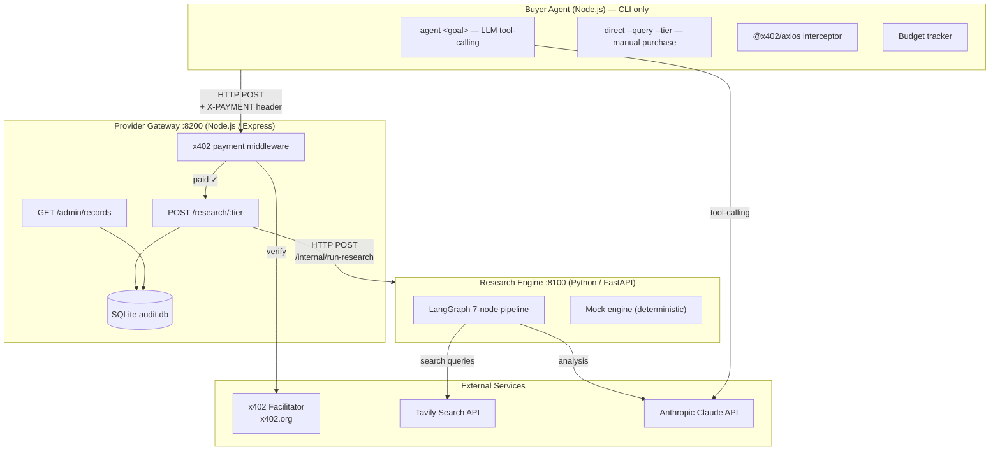
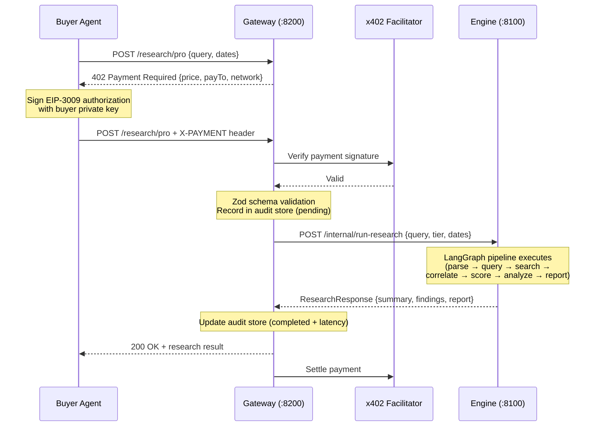
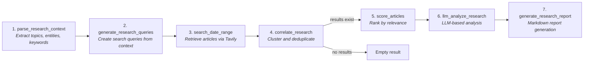

# System Overview

## Design Principles

1. **Separation of concerns** — Payment validation is middleware, never coupled to research logic.
2. **Language-appropriate services** — Python for ML/NLP pipeline (LangGraph), TypeScript for HTTP + payments.
3. **Deterministic demo** — Mock mode enables full-flow testing without API keys or funded wallets.
4. **Tier-based productization** — Same research pipeline, configurable depth per tier.

## Service Architecture

## Data Flow

## Service Boundaries

### Buyer Agent (`apps/buyer-agent`)
- **Role**: Consumer of the paid research API
- **Modes**: LLM agent (Anthropic tool-calling) or direct CLI purchase
- **Payment**: `@x402/axios` interceptor handles 402 → sign → retry transparently
- **Budget**: Per-request and daily spending limits enforced before purchase
- **Port**: N/A (CLI only)

### Provider Gateway (`apps/provider-gateway`)
- **Role**: Public HTTP API, payment enforcer, request router
- **Payment**: `@x402/express` middleware returns 402 for unpaid requests, validates payment headers
- **Audit**: SQLite `run_records` table tracks every request with payment status and latency
- **Port**: 8200

### Research Engine (`services/research-engine`)
- **Role**: Internal research pipeline, never exposed publicly
- **Pipeline**: 7-node LangGraph graph (parse → query → search → correlate → score → analyze → report)
- **Tiers**: basic (8 queries, no report), pro (15 queries, full), deep (25 queries, full)
- **Port**: 8100

## LangGraph Pipeline Detail

## Network & Payment

- **Chain**: Base Sepolia (CAIP-2: `eip155:84532`)
- **Asset**: USDC testnet (6 decimals)
- **Facilitator**: `https://x402.org/facilitator` (verifies + settles payments)
- **Scheme**: `exact` (ExactEvmScheme — EIP-3009 transferWithAuthorization)

## Mock Mode

When `MOCK_MODE=true`:
- **Research engine** returns deterministic canned responses (no Tavily/LLM calls)
- **Provider gateway** skips x402 payment middleware (no wallet needed)
- **Buyer agent** still runs the full HTTP flow, just without real payment signing

This enables the full demo to run with zero external dependencies.
