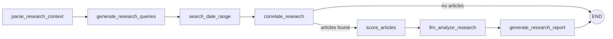

# x402 Agentic Research Demo — Implementation Plan

## Goal
Build a portfolio-grade demo that shows **an AI buyer agent purchasing premium on-demand Web3 market research from a paid HTTP provider using x402**.

The demo must clearly show both participants:
- **Provider / Seller**: paid research API protected by x402
- **Buyer**: agent/client that requests research, receives `402 Payment Required`, pays, retries, and receives the result

The research engine will reuse the existing **Python + LangGraph** workflow. The x402 integration layer will be implemented in **Node.js / TypeScript**.

---

## Final Stack
- **Buyer agent**: Node.js + TypeScript + `@x402/axios` or `@x402/fetch`
- **Paid provider gateway**: Node.js + TypeScript + Express/Fastify + x402 server middleware
- **Research engine**: Python + LangGraph
- **Network**: Base Sepolia
- **Asset**: USDC testnet
- **Demo mode**: HTTP endpoint first, MCP later
- **Observability**: structured logs + persisted run/payment metadata
- **Optional UI later**: lightweight web dashboard

---

## Delivery Principles
1. **Each stage must be completed and tested before starting the next one.**
2. Keep the system runnable locally with a minimal number of services.
3. Favor a deterministic demo over maximum scope.
4. Separate payment concerns from research orchestration.
5. Never couple x402 logic directly into LangGraph nodes.
6. Every public-facing behavior must be demonstrable through CLI first.

---

## High-Level Architecture

### Services
1. **buyer-agent**
   - Sends research requests
   - Handles `402 -> pay -> retry`
   - Displays final report and payment trace

2. **provider-gateway**
   - Public paid HTTP API
   - Protected by x402
   - Validates payment
   - Calls internal Python research engine only after successful payment validation

3. **research-engine**
   - Python service wrapping the existing LangGraph workflow
   - Receives normalized research jobs
   - Runs workflow
   - Returns structured JSON and optionally Markdown

### Recommended Monorepo Layout
```text
x402-agentic-research-demo/
  apps/
    buyer-agent/
    provider-gateway/
    demo-cli/
  services/
    research-engine/
  docs/
    architecture/
    api/
    runbooks/
  scripts/
  .env.example
  docker-compose.yml
  README.md
```

---

## Stage 0 — Project Setup and Prerequisites

### Objectives
Set up the repository, dev environment, secrets strategy, and execution conventions.

### Tasks
- Create monorepo structure.
- Initialize Node.js/TypeScript workspaces for `buyer-agent`, `provider-gateway`, and optional `demo-cli`.
- Add Python service folder for `research-engine`.
- Define shared environment variable naming conventions.
- Add formatting/linting/testing baselines:
  - Node: ESLint, Prettier, Vitest/Jest
  - Python: Ruff, Black, pytest
- Add `.env.example` with placeholders only.
- Add `Makefile` or `justfile` with common commands.
- Add root `README.md` with architecture summary and local startup instructions.
- Add a `docs/architecture/system-overview.md` file with a sequence diagram.

### Required Environment Variables
At minimum define placeholders for:
- `X402_NETWORK`
- `X402_FACILITATOR_URL`
- `X402_RECIPIENT_ADDRESS`
- `BUYER_PRIVATE_KEY`
- `RESEARCH_ENGINE_BASE_URL`
- `GOOGLE_API_KEY` or equivalent Gemini credentials
- Any search/news provider credentials used by the research engine
- `LOG_LEVEL`

### Acceptance Criteria
- Fresh clone can install dependencies successfully.
- All services have a `dev`, `test`, and `lint` command.
- `.env.example` is complete enough for another engineer to configure the project.
- Monorepo structure is stable and documented.

### Tests
- Run install in every workspace.
- Run lint in every workspace.
- Run test placeholders successfully.

---

## Stage 1 — Normalize the Research Engine Contract

### Objectives
Wrap the existing LangGraph workflow in a clean internal API contract before adding payments.

### Tasks
- Audit the existing Python workflow inputs and outputs.
- Define a **normalized job request schema** for the provider to send to the research engine.
- Define a **normalized response schema** for results.
- Add a Python HTTP endpoint, e.g. `POST /internal/run-research`.
- Convert existing workflow state and outputs into a stable response model.
- Ensure the engine can return both:
  - compact JSON summary
  - optional detailed Markdown report
- Add timeout handling and explicit failure responses.
- Add a deterministic mock mode for local testing when external providers are unavailable.

### Suggested Request Schema
```json
{
  "query": "Compare yield-bearing stablecoins on Cardano vs Ethereum",
  "start_date": "2025-10-01",
  "end_date": "2026-03-01",
  "tier": "pro",
  "format": "json",
  "max_articles": 40,
  "request_id": "uuid"
}
```

### Suggested Response Schema
```json
{
  "request_id": "uuid",
  "status": "completed",
  "tier": "pro",
  "summary": "...",
  "key_findings": ["..."],
  "sources": [
    {
      "title": "...",
      "url": "...",
      "date": "...",
      "score": 4
    }
  ],
  "confidence": 0.82,
  "report_markdown": "...",
  "timings": {
    "total_ms": 12345
  },
  "metadata": {
    "articles_analyzed": 18,
    "clusters": 6
  }
}
```

### Acceptance Criteria
- The research engine can be called independently of x402.
- Input/output schemas are documented and stable.
- Existing LangGraph workflow runs through the wrapper without regression.
- Mock mode works and returns a realistic response.

### Tests
- Unit tests for request validation.
- Integration test hitting `/internal/run-research` in mock mode.
- Integration test hitting `/internal/run-research` against the real workflow.
- Failure test for invalid date range.
- Failure test for engine timeout.

---

## Stage 2 — Tiering and Research Productization

### Objectives
Turn the research capability into a priced product with clear service tiers.

### Tasks
- Define research tiers: `basic`, `pro`, `deep`.
- Map each tier to workflow behavior.
- Implement tier-specific constraints:
  - query count
  - article limits
  - report depth
  - whether full Markdown report is included
- Add internal pricing metadata config.
- Add internal SKU/service IDs for future extensibility.
- Decide whether unsupported combinations should fail or downgrade.

### Example Tier Mapping
- **basic**
  - short summary
  - lighter search volume
  - lower article cap
- **pro**
  - full scoring and synthesis
  - structured findings + sources
- **deep**
  - full report markdown
  - expanded article set
  - richer metadata and trace

### Acceptance Criteria
- Each tier produces a visibly different result.
- Tier behavior is deterministic and documented.
- Research engine enforces tier constraints correctly.

### Tests
- Snapshot tests per tier using mock mode.
- Integration test proving `deep` returns richer output than `basic`.
- Validation test for unsupported tier values.

---

## Stage 3 — Provider Gateway Without Payments

### Objectives
Create the public HTTP API contract and integrate it with the Python engine before introducing x402.

### Tasks
- Build `provider-gateway` in Node.js/TypeScript.
- Add public endpoint: `POST /research/on-demand`.
- Validate request payloads using a schema library.
- Forward normalized requests to the Python engine.
- Standardize provider responses and errors.
- Add request IDs and correlation IDs.
- Add structured logs for ingress, engine call, latency, and result status.
- Persist minimal run metadata in a lightweight store:
  - JSON file, SQLite, or Postgres if already convenient

### Provider Response Shape
```json
{
  "request_id": "uuid",
  "status": "completed",
  "result": {
    "summary": "...",
    "key_findings": ["..."],
    "sources": []
  },
  "payment": {
    "required": false,
    "tier": "pro"
  }
}
```

### Acceptance Criteria
- Public endpoint works end-to-end without x402 enabled.
- Provider can call the Python engine and return normalized output.
- Error handling is explicit and consistent.
- Logs show correlation IDs across provider and engine.

### Tests
- Unit tests for payload validation.
- Integration test for successful provider-to-engine call.
- Integration test for engine failure propagation.
- Contract test comparing public response schema to documentation.

---

## Stage 4 — x402 Protection on the Provider Gateway

### Objectives
Protect the public endpoint with x402 and enforce payment before execution.

### Tasks
- Add x402 server middleware to `provider-gateway`.
- Configure Base Sepolia + USDC testnet settings.
- Protect `POST /research/on-demand`.
- Associate price by tier.
- Return `402 Payment Required` with correct payment requirements for unpaid requests.
- Ensure the provider only calls the Python engine after successful payment validation.
- Ensure failed engine executions do not silently look like success.
- Log payment challenge creation and verification outcomes.

### Pricing Recommendation for Demo
Use simple, obvious demo prices:
- `basic`: 0.01 USDC
- `pro`: 0.03 USDC
- `deep`: 0.05 USDC

### Important Implementation Rule
The provider must not start the LangGraph workflow before payment verification succeeds.

### Acceptance Criteria
- Unpaid request receives a valid `402 Payment Required` response.
- Paid retry reaches the research engine successfully.
- Tier-specific prices are enforced.
- Logs show clear before/after payment transitions.

### Tests
- Integration test for unpaid request returning 402.
- Integration test for valid paid request succeeding.
- Integration test for malformed payment signature failing.
- Integration test proving no engine invocation happened on unpaid request.

---

## Stage 5 — Buyer Agent: 402 -> Pay -> Retry Flow

### Objectives
Implement the buyer side that programmatically purchases research.

### Tasks
- Build `buyer-agent` in Node.js/TypeScript.
- Configure signer/private key for Base Sepolia test wallet.
- Implement a `purchaseResearch()` client method.
- Use x402 client tooling to handle challenge parsing, signing, and retry.
- Print a clean execution trace:
  - request sent
  - 402 received
  - payment prepared
  - payment signed
  - request retried
  - result received
- Add support for tier selection.
- Add support for budget ceilings:
  - `max_price_per_request`
  - optional `daily_budget`
- Add user-friendly error messages for insufficient funds or unsupported network.

### Buyer CLI Example
```bash
pnpm buyer research \
  --query "Compare yield-bearing stablecoins on Cardano vs Ethereum" \
  --start-date 2025-10-01 \
  --end-date 2026-03-01 \
  --tier pro
```

### Acceptance Criteria
- Buyer can successfully purchase a report from the provider.
- Buyer logs clearly show the x402 challenge/response flow.
- Buyer refuses payment when request price exceeds configured threshold.
- Buyer handles failed payment or provider errors cleanly.

### Tests
- Integration test against a local provider requiring payment.
- Failure test for insufficient wallet balance.
- Failure test for max-price threshold exceeded.
- Snapshot test of CLI logs for the happy path.

---

## Stage 6 — Demo CLI and End-to-End Developer Experience

### Objectives
Make the full flow easy to run locally and easy to demo live.

### Tasks
- Create `demo-cli` or extend `buyer-agent` with a polished command set.
- Add startup scripts to run all required services.
- Add a single command to execute an end-to-end scenario.
- Add a seeded mock/demo query.
- Add a script to print the provider’s stored run/payment records.
- Add a `demo mode` flag that minimizes external dependencies where possible.

### Recommended Commands
- `make dev`
- `make test`
- `make demo`
- `make demo-mock`
- `make logs`

### Acceptance Criteria
- A new engineer can run the end-to-end flow with documented commands.
- The demo can be run in under 10 minutes once env vars are configured.
- The output is understandable without code inspection.

### Tests
- Smoke test for `make demo-mock`.
- Smoke test for `make demo` against live testnet configuration.

---

## Stage 7 — Observability, Persistence, and Audit Trail

### Objectives
Make the project look production-aware and explainable.

### Tasks
- Persist run records and payment metadata.
- Store at minimum:
  - request ID
  - query
  - tier
  - quoted price
  - payment status
  - provider status
  - timestamps
  - engine latency
- Add correlation IDs across services.
- Add structured JSON logging.
- Add basic metrics counters if convenient.
- Add a simple endpoint or command to inspect history.

### Suggested Record Model
```json
{
  "request_id": "uuid",
  "query": "...",
  "tier": "pro",
  "quoted_price": "0.03",
  "asset": "USDC",
  "network": "base-sepolia",
  "payment_status": "paid",
  "provider_status": "completed",
  "engine_latency_ms": 9321,
  "created_at": "...",
  "completed_at": "..."
}
```

### Acceptance Criteria
- Every request is traceable across buyer, provider, and research engine.
- Demo output can show payment and execution metadata afterward.
- Failure paths are visible and diagnosable.

### Tests
- Integration test verifying audit record creation.
- Test ensuring unpaid requests are logged distinctly from paid ones.

---

## Stage 8 — Documentation and Portfolio Packaging

### Objectives
Turn the implementation into a strong GitHub portfolio artifact.

### Tasks
- Write a polished `README.md` with:
  - project motivation
  - architecture
  - x402 payment flow
  - LangGraph workflow integration
  - setup instructions
  - example commands
  - screenshots or terminal captures
- Add diagrams:
  - system architecture diagram
  - sequence diagram for `402 -> pay -> retry`
  - mapping of research tiers to workflow depth
- Add a short `docs/runbooks/local-demo.md`.
- Add `docs/decisions/` ADRs for key choices:
  - why Base Sepolia
  - why Node gateway + Python engine
  - why HTTP endpoint before MCP
- Add a sample demo transcript in Markdown.
- Record at least one terminal capture or GIF if possible.

### Acceptance Criteria
- README is enough for someone else to understand the project quickly.
- Architecture and payment flow are visually clear.
- Repo communicates both AI and Web3 depth.

### Tests
- Documentation review from a fresh-reader perspective.
- Reproduce setup from README on a clean machine or container.

---

## Stage 9 — Hardening Before Optional UI

### Objectives
Stabilize the demo before adding non-essential scope.

### Tasks
- Revisit all error paths.
- Add retry policies where appropriate.
- Add timeouts and cancellation boundaries.
- Add idempotency safeguards if duplicate request handling is relevant.
- Validate provider behavior when the engine is slow or unavailable.
- Validate buyer behavior when the provider returns unexpected data.
- Verify secrets are never logged.
- Add basic rate-limiting if useful.

### Acceptance Criteria
- Demo is reliable enough for a live portfolio walkthrough.
- Major failure paths produce understandable output.
- Sensitive data handling is clean.

### Tests
- Chaos-style tests for provider timeout.
- Failure injection for engine crash.
- Regression run of all previous stage tests.

---

## Stage 10 — Optional Enhancements After Core Completion

Only start this stage after all previous stages are complete and verified.

### Option A — Lightweight Web UI
- Search form
- Tier selector
- Result viewer
- Payment trace viewer

### Option B — MCP Layer
- Expose the provider capability through MCP after the plain HTTP demo is stable

### Option C — Budget-Aware Buyer Policy
- Buyer decides whether premium research is worth paying for based on query type or confidence

### Option D — Cardano Roadmap Document
- Design document for future Cardano support
- Explain why current MVP uses Base Sepolia
- Outline how a Cardano payment scheme/facilitator might work later

---

## Recommended Stage-by-Stage Order
1. Stage 0 — Project Setup and Prerequisites
2. Stage 1 — Normalize the Research Engine Contract
3. Stage 2 — Tiering and Research Productization
4. Stage 3 — Provider Gateway Without Payments
5. Stage 4 — x402 Protection on the Provider Gateway
6. Stage 5 — Buyer Agent: 402 -> Pay -> Retry Flow
7. Stage 6 — Demo CLI and End-to-End Developer Experience
8. Stage 7 — Observability, Persistence, and Audit Trail
9. Stage 8 — Documentation and Portfolio Packaging
10. Stage 9 — Hardening Before Optional UI
11. Stage 10 — Optional Enhancements

---

## Mandatory Definition of Done Per Stage
A stage is complete only if all of the following are true:
- Code is implemented
- Local manual verification was performed
- Automated tests for that stage pass
- Docs were updated
- No TODOs remain that block the next stage

---

## Codex CLI Notes
This project is a good fit for Codex CLI, but a few constraints matter.

### What to keep in mind
1. **Ask Codex CLI to work one stage at a time.**
   Do not ask it to build the whole system in one shot.
2. **Give it exact boundaries.**
   Example: “Implement Stage 3 only. Do not start x402 integration yet.”
3. **Require tests before stage completion.**
   Make test creation part of every prompt.
4. **Use deterministic mock mode early.**
   This will reduce drift and make generated code more reliable.
5. **Make Codex update docs as part of the task.**
   Otherwise the implementation and README may diverge.
6. **Provide existing LangGraph code context explicitly.**
   Codex will do better if you point it to the exact Python modules and state schema.
7. **Keep secrets out of prompts.**
   Use `.env.example` and local env configuration only.
8. **Expect to review x402 package usage carefully.**
   Payment SDK integration is the part most worth manually reviewing.
9. **Prefer small commits per stage.**
   This makes rollback and correction much easier.
10. **Have Codex emit a verification checklist at the end of each stage.**

### Recommended Prompting Pattern for Codex CLI
For each stage, give Codex a prompt shaped like this:

```text
Implement Stage N from docs/x402-agentic-research-implementation-plan.md.

Constraints:
- Only implement this stage.
- Do not start later stages.
- Add or update tests required for this stage.
- Update README/docs impacted by this stage.
- Keep code production-style and typed.
- Before finishing, run or describe the exact verification steps.
```

---

## What You Need to Prepare Manually
Before implementation starts, prepare these items yourself:

1. **A funded Base Sepolia buyer wallet**
   - with enough test funds for repeated demo runs
   - with the correct test asset expected by your chosen x402 flow

2. **A recipient address for the provider**
   - the address that will receive or be associated with the payment flow

3. **Access to the existing LangGraph codebase**
   - especially the exact modules listed in your current workflow
   - plus any required credentials for Gemini/search/news providers

4. **A decision on persistence for the MVP**
   - SQLite is usually enough
   - Postgres only if you already have it ready

5. **A decision on mock vs live default mode**
   - recommended default for development: mock mode
   - recommended default for final demo: live mode

6. **A clear list of external APIs used by the research engine**
   - so rate limits and secret management are handled from the start

---

## Existing LangGraph Workflow to Reuse



### Current Node Mapping
| Node | Source File | LLM Model | Purpose |
|---|---|---|---|
| `parse_research_context` | `src/nodes/research_analysis/context_parser.py` | Gemini Flash (semantic analysis, regex fallback) | Parse free-text context, extract topics/entities, determine query intent and metric direction |
| `generate_research_queries` | `src/nodes/research_analysis/query_generator.py` | Gemini Flash (pattern-based fallback) | Generate 15-25 diverse search queries from research context |
| `search_date_range` | `src/nodes/research_analysis/date_range_searcher.py` | — | Execute queries within start_date/end_date range |
| `correlate_research` | `src/nodes/research_analysis/research_correlator.py` | — (embedding: all-MiniLM-L6-v2) | URL validation, term filtering, relevance scoring, clustering dedup |
| `score_articles` | `src/nodes/research_analysis/article_scorer.py` | Gemini Flash | LLM-based article triage, batch scoring (15/batch), relevance 1-5 + article type |
| `llm_analyze_research` | `src/nodes/research_analysis/research_analyzer.py` | Flash (extract) + Flash (rank) + Pro (synthesize) | 3-step pipeline: event extraction/classification, causal ranking, synthesis |
| `generate_research_report` | `src/nodes/research_analysis/report_generator.py` | — | Render Jinja2 template, save to GCS, email/Slack delivery |

### Current State Fields
- `research_context`
- `research_date_range`
- `research_parsed_context`
- `research_search_batches`
- `research_search_results`
- `research_article_scores`
- `research_semantic_context`
- `research_analysis_result`
- `final_report`
- `report_filepath`

---

## Suggested First Codex Task
Start with:

**Stage 0 — Project Setup and Prerequisites**

Then move to:

**Stage 1 — Normalize the Research Engine Contract**

Do not start x402 integration until Stage 3 is fully working and tested.
